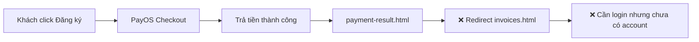
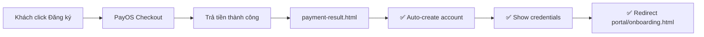

# 🚀 Sprint 2: Post-Payment Flow — Plan cho OpenClaw

## Mục tiêu
Khi khách trả tiền thành công qua PayOS → **tự động nhận được account + vào portal ngay**.

---

## Hiện trạng (GAP Analysis)



**Sau fix Sprint 2:**



---

## Phase A: Edge Function `activate-subscription`

#### [NEW] `supabase/functions/activate-subscription/index.ts`

Logic:
1. Nhận `orderCode` từ PayOS callback
2. Query `payment_transactions` table → lấy thông tin gói
3. Tạo user account qua `supabase.auth.admin.createUser()`
4. Insert vào `clients` table với `subscription_plan` + `subscription_start`
5. Return `{ email, tempPassword, portalUrl }`

```typescript
// Pseudo-code
serve(async (req) => {
  const { orderCode, packageName, amount, buyerEmail, buyerPhone } = await req.json();

  // 1. Verify payment exists and is successful
  const { data: txn } = await supabase
    .from('payment_transactions')
    .select('*')
    .eq('transaction_id', orderCode)
    .eq('status', 'success')
    .single();

  if (!txn) return error('Payment not found or not successful');

  // 2. Create user account
  const tempPassword = generateTempPassword(); // 8 chars
  const { data: user } = await supabase.auth.admin.createUser({
    email: buyerEmail,
    password: tempPassword,
    email_confirm: true,
    user_metadata: { role: 'client', package: packageName }
  });

  // 3. Create client record
  await supabase.from('clients').insert({
    user_id: user.id,
    email: buyerEmail,
    phone: buyerPhone,
    subscription_plan: packageName,
    subscription_start: new Date().toISOString(),
    status: 'active'
  });

  return { success: true, email: buyerEmail, tempPassword, portalUrl: '/portal/dashboard.html' };
});
```

> [!IMPORTANT]
> Cần `SUPABASE_SERVICE_ROLE_KEY` (đã có) để dùng `auth.admin.createUser()`.

---

## Phase B: Upgrade `payment-result.html`

#### [MODIFY] `portal/payment-result.html`

Thay đổi:
1. Khi PayOS callback `code=00` + `status=PAID`:
   - Hiện form nhập **email + SĐT** (để tạo account)
   - Hoặc tự lấy từ form trước đó (localStorage)
2. Call `activate-subscription` edge function
3. Hiện **credentials card**: Email + Mật khẩu tạm
4. Nút "Vào Portal" → redirect `portal/onboarding.html`

```
┌──────────────────────────────┐
│  ✅ Thanh toán thành công!   │
│                              │
│  Mã giao dịch: 43091795      │
│  Số tiền: 12.000.000 ₫       │
│  Gói: Tăng trưởng            │
│                              │
│  ━━━ Tài khoản của bạn ━━━   │
│  Email: user@email.com       │
│  Mật khẩu: Abc12345          │
│  ⚠️ Hãy đổi mật khẩu ngay   │
│                              │
│  [🚀 Vào Portal ngay]       │
└──────────────────────────────┘
```

---

## Phase C: Onboarding Wizard

#### [NEW] `portal/onboarding.html`

Trang welcome cho khách mới đăng ký:
- Step 1: **Chào mừng** — giới thiệu portal
- Step 2: **Đổi mật khẩu** — form change password
- Step 3: **Thông tin doanh nghiệp** — company name, industry, website
- Step 4: **Hoàn tất** → redirect `portal/dashboard.html`

---

## Supabase Migration

```sql
-- Thêm columns cho clients table (nếu chưa có)
ALTER TABLE clients ADD COLUMN IF NOT EXISTS subscription_plan TEXT;
ALTER TABLE clients ADD COLUMN IF NOT EXISTS subscription_start TIMESTAMPTZ;
ALTER TABLE clients ADD COLUMN IF NOT EXISTS subscription_end TIMESTAMPTZ;
ALTER TABLE clients ADD COLUMN IF NOT EXISTS onboarding_completed BOOLEAN DEFAULT FALSE;
```

---

## Lệnh giao OpenClaw — 3 Sessions

### Session 1: Edge Function + Migration

```bash
claude "Sprint 2 Phase A - Tạo edge function activate-subscription:

Theo plan .tasks/sprint2-post-payment.md:

1. Tạo file supabase/functions/activate-subscription/index.ts:
   - Import từ _shared/payment-utils.ts
   - Nhận POST body: { orderCode, packageName, amount, buyerEmail, buyerPhone }
   - Verify payment từ payment_transactions table
   - Tạo user account: supabase.auth.admin.createUser({email, password: random_8_chars, email_confirm: true, user_metadata: {role: 'client', package: packageName}})
   - Insert vào clients table: {user_id, email, phone, subscription_plan, subscription_start, status: 'active'}
   - Return: {success: true, email, tempPassword, portalUrl: '/portal/dashboard.html'}
   - Handle duplicate email (user already exists)
   - CORS headers from _shared

2. Deploy: supabase functions deploy activate-subscription --no-verify-jwt

3. Test:
curl -s -X POST SUPABASE_URL/functions/v1/activate-subscription \\
  -H 'Content-Type: application/json' \\
  -H 'Authorization: Bearer ANON_KEY' \\
  -d '{\"orderCode\":\"43091795\",\"packageName\":\"Tăng trưởng\",\"amount\":12000000,\"buyerEmail\":\"test@mekongmarketing.com\",\"buyerPhone\":\"0915997989\"}'

KHÔNG sửa bất kỳ edge function nào khác."
```

### Session 2: Payment Result + Email Form

```bash
claude "Sprint 2 Phase B - Upgrade payment-result.html:

Theo plan .tasks/sprint2-post-payment.md:

1. Sửa portal/payment-result.html:
   - Khi PayOS success (code=00, status=PAID):
     a. Hiện form 'Hoàn tất đăng ký' với 2 field: Email + SĐT
     b. Nút 'Kích hoạt tài khoản'
     c. Gọi activate-subscription edge function
     d. Hiện card credentials: Email + Mật khẩu tạm + nút 'Đổi mật khẩu'
     e. Nút 'Vào Portal ngay' → /portal/onboarding.html
   - Giữ nguyên flow VNPay/MoMo/Cancel/Pending handlers
   - SUPABASE_URL fallback giống index.html: hardcode nếu window.__ENV__ undefined

2. Style match M3 hiện tại (dùng portal.css + m3-agency.css)

3. Git commit: 'feat(sprint2): payment-result auto-activation form'

KHÔNG sửa index.html hay payment-modal.js."
```

### Session 3: Onboarding Wizard

```bash
claude "Sprint 2 Phase C - Tạo portal/onboarding.html:

Theo plan .tasks/sprint2-post-payment.md:

1. Tạo portal/onboarding.html - Onboarding wizard 4 bước:
   - Step 1: Welcome - Chào mừng + giới thiệu portal features
   - Step 2: Change Password - Form đổi mật khẩu (supabase.auth.updateUser)
   - Step 3: Business Info - Form: company_name, industry (dropdown), website_url
     → Update clients table
   - Step 4: Complete - Success message + nút 'Vào Dashboard'

2. Style: Import m3-agency.css + portal.css, match design language
3. Stepper UI: horizontal progress bar 4 dots
4. Responsive mobile-first
5. Auth check: redirect to login if not authenticated

6. Git add + commit + push + wrangler pages deploy"
```

---

## Verification

Sau khi chạy 3 sessions, test E2E:
1. Mở `https://sadec-marketing-hub.pages.dev`
2. Scroll → Pricing → Click "Đăng ký ngay" (Tăng trưởng 12M)
3. PayOS checkout → thanh toán
4. Redirect về payment-result.html → hiện form email/SĐT
5. Nhập email → Click "Kích hoạt" → nhận credentials
6. Click "Vào Portal" → onboarding wizard
7. Đổi mật khẩu → điền thông tin → hoàn tất → Dashboard
